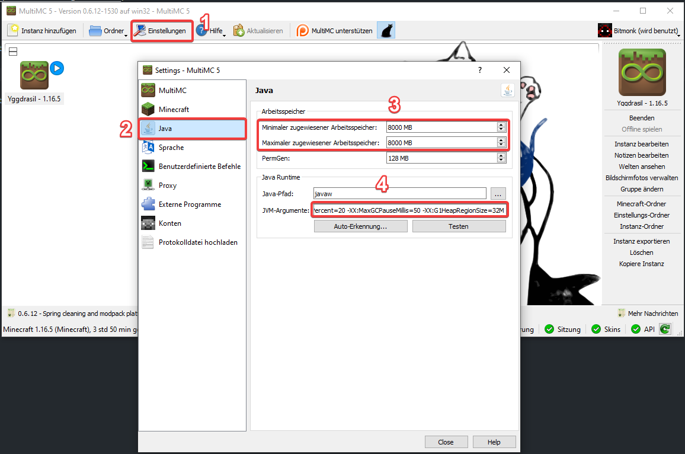

# How-To

## TL;DR - Ich weiß was ich tue

[Yggdrasil Modpack - 1.16.5](https://drive.google.com/file/d/1N-kB6476df--vH0SLJ9Pj0e8wj3-X6xB/view?usp=sharing)

```
Server Adresse: bitmonk.de
```

## Schritt 1 - MultiMC installieren

[Hier](https://multimc.org/#Download) die aktuellste Version von MultiMC herunterladen und installieren.

> MultiMC ist ein Minecraft-Launcher um mehrere Instanzen zu managen

## Schritt 2 - Java Args

Um mit einer hohen Anzahl von Mods zu spielen braucht Minecraft (bzw. Java) ausreichend Arbeitsspeicher. Öffne dafür die Einstellungen (1) und dort den Reiter Java (2). Hier siehst du zwei Eingabefelder für den minimalen und maximalen Arbeitsspeicher (3).

Trage in beide Felder mindestens 5000MB ein, bestenfalls 8000MB. Stelle vorher sicher, dass du auch ausreichend Arbeitsspeicher zur Verfügung hast. Wenn du nur insgesamt 8GB Arbeitsspeicher hast probiere erstmal 5000MB oder 6000MB.

Um noch etwas mehr Performance herauszukitzeln könnt ihr noch JVM-Argumente mitangeben (4):

```
-XX:+UseG1GC -Dsun.rmi.dgc.server.gcInterval=2147483646 -XX:+UnlockExperimentalVMOptions -XX:G1NewSizePercent=20 -XX:G1ReservePercent=20 -XX:MaxGCPauseMillis=50 -XX:G1HeapRegionSize=32M
```

Das ist zwar an sich nicht unbedingt notwendig aber wenn ihr beim Spielen immer mal wieder "ruckler" erlebt können die Args helfen.



## Schritt 3 - Instanz herunterladen und importieren

Die MultiMC mit allen Mods und Configs bekommt ihr Hier:

[Yggdrasil Modpack - 1.16.5](https://drive.google.com/file/d/1N-kB6476df--vH0SLJ9Pj0e8wj3-X6xB/view?usp=sharing).

Diese müsst ihr einfach per Drag&Drop in das Fenster vom MultiMC-Launcher ziehen.

Neben allen notwendigen Servermods enthält sie auch folgende optionalen Clientmods:

- Better Foliage + cloth-config
  - Schönere Bäume, Gras und andere Shader-Effekte.
  - Im Hauptmenü unter Mods -> BetterFoliage -> Config könnt ihr weitere Einstellungen vornehmen.
- Controlling
  - Fügt ein Suchfeld bei den Controls hinzu um einfacher bestimmte Keybindings zu finden
- CraftPresence
  - Fügt Discord Presence hinzu
- Ding
  - Erzeugt ein "Ding"-Geräusch wenn alle Mods fertig geladen sind
- DynamicSurroundings
  - Ein paar zusätzliche Geräusche in der Umgebung
- Neat+
  - Lebensanzeige und Name von Entities über deren Köpfen
- OptiFine
  - FPS- und Grafikoptimierungen
- ReAuth
  - Falls eure Mojang Session mal ausläuft während Minecraft noch offen ist könnt ihr euch damit im Spiel einfach neu einloggen. Das spart das warten beim Neustarten.
- SoundFilters
  - Fügt hall in Höhlen hinzu und dämpft Geräusche je nach Wänden die zwischen dir und der Quelle liegen.

Alle Clientmods sind optional und können auch einfach entfernt werden wenn nicht gewünscht.

## Schritt 4 - Spiel starten und Serverdaten eingeben

Den Server erreicht ihr unter der Adresse `bitmonk.de`. Meldet euch bitte vorher bei mir damit ich euch auf die Whitelist setze.

> Ihr dürft das Modpack gerne auch für euren eigenen Server benutzen
